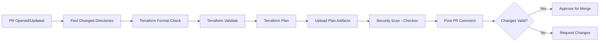
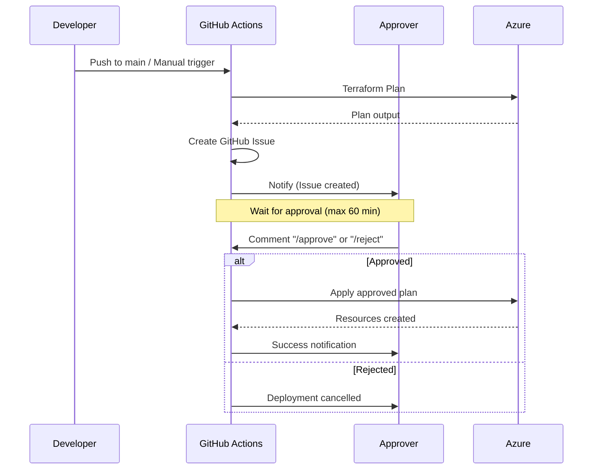

# CI/CD Pipeline Strategy - Best Practices

This document outlines the CI/CD pipeline strategy implemented in this Azure Landing Zone repository, demonstrating industry best practices for Terraform-based infrastructure deployment.

## Table of Contents

- [Overview](#overview)
- [Pipeline Architecture](#pipeline-architecture)
- [PR Validation Flow](#pr-validation-flow)
- [Deployment Flow](#deployment-flow)
- [Infrastructure Layers](#infrastructure-layers)
- [Best Practices Implemented](#best-practices-implemented)
- [Security Considerations](#security-considerations)

---

## Overview

This repository implements a comprehensive CI/CD strategy that separates concerns between **validation** (PR flow) and **deployment** (main branch flow), with multi-layer infrastructure orchestration that respects dependencies while enabling parallel execution where safe.

### Key Principles

1. **Shift-Left Testing**: Validate infrastructure changes before merge
2. **Approval Gates**: Human approval required for production changes
3. **Immutable Plans**: Deploy exactly what was approved, no re-planning
4. **Layered Deployment**: Respect infrastructure dependencies
5. **Parallel Execution**: Deploy independent resources concurrently
6. **Security Scanning**: Automated security checks on every PR
7. **Visibility**: Detailed plan output in PR comments and approval issues

---

## Pipeline Architecture

```
┌─────────────────────────────────────────────────────────────────────┐
│                     PR VALIDATION FLOW                              │
│                                                                     │
│  Pull Request → Validate → Plan → Security Scan → Comment Results  │
│                    ↓          ↓          ↓                         │
│                  Format    Preview    Checkov                      │
│                  Validate  Changes    Security                     │
│                                                                     │
└─────────────────────────────────────────────────────────────────────┘
                              ↓
                         Merge to Main
                              ↓
┌─────────────────────────────────────────────────────────────────────┐
│                    DEPLOYMENT FLOW                                  │
│                                                                     │
│  Main Branch → Plan → Create Approval Issue → Wait for /approve    │
│                  ↓                               ↓                  │
│              Upload Plan                    Poll for Approval       │
│                                                 ↓                   │
│                                     Apply Approved Plan → Notify    │
│                                                                     │
└─────────────────────────────────────────────────────────────────────┘
```

---

## PR Validation Flow

### Workflow: `terraform-validate.yml`

**Trigger**: Pull Request to `main` branch

**Purpose**: Validate Terraform changes before merge, provide detailed feedback

### Pipeline Steps



### Features Implemented

#### 1. Smart Directory Detection
```yaml
# Finds only directories with changed .tf or .tfvars.example files
# Avoids running validations on unchanged infrastructure
```

**Best Practice**: ✅ Only validate what changed - faster feedback, lower cost

#### 2. Parallel Validation
```yaml
strategy:
  matrix:
    directory: ${{ fromJson(needs.find-changed-dirs.outputs.directories) }}
  max-parallel: 10
```

**Best Practice**: ✅ Validate multiple directories concurrently

#### 3. Plan Output in PR Comments

The workflow posts detailed comments showing:
- **Change Summary**: `+X to add, ~Y to change, -Z to destroy`
- **Resource Changes**: Collapsible section with actual resources being modified
- **Full Plan**: Complete Terraform plan output for review

```markdown
## Terraform Plan - 00-bootstrap

**Plan Summary**: +5 to add, ~0 to change, -0 to destroy

<details>
<summary>📦 Resource Changes</summary>

  + azurerm_storage_account.tfstate
  + azurerm_storage_container.bootstrap
  ...
</details>

<details>
<summary>📋 Full Terraform Plan Output</summary>

...complete plan...
</details>
```

**Best Practice**: ✅ Make infrastructure changes visible and reviewable

#### 4. Security Scanning

Integrated Checkov security scanning on every PR:
```yaml
- name: Run Checkov
  uses: bridgecrewio/checkov-action@v12
  with:
    directory: ${{ matrix.directory }}
    framework: terraform
```

**Best Practice**: ✅ Catch security misconfigurations early

#### 5. Azure OIDC Authentication

No stored credentials - uses federated identity:
```yaml
- name: Azure Login
  uses: azure/login@v2
  with:
    client-id: ${{ secrets.AZURE_CLIENT_ID }}
    tenant-id: ${{ secrets.AZURE_TENANT_ID }}
```

**Best Practice**: ✅ Passwordless authentication, automatic credential rotation

---

## Deployment Flow

### Two Deployment Workflows

#### 1. `deploy-bootstrap.yml` - Bootstrap Layer Deployment

**Trigger**: 
- Push to `main` (00-bootstrap changes)
- Manual dispatch

**Purpose**: Deploy state storage infrastructure with approval gate

#### 2. `deploy-all.yml` - Complete Infrastructure Deployment

**Trigger**: Manual dispatch only

**Purpose**: Orchestrate deployment of all infrastructure layers

### Approval Workflow Pattern



### Key Features

#### 1. Manual Approval Gates

```yaml
wait-for-approval:
  needs: plan
  runs-on: ubuntu-latest
  steps:
    - name: Poll for Approval
      run: |
        # Check for /approve or /reject every 30 seconds
        # Timeout after 60 minutes
```

**Best Practice**: ✅ Human verification before applying infrastructure changes

#### 2. Immutable Plan Application

```yaml
plan:
  steps:
    - name: Terraform Plan
      run: terraform plan -out=tfplan
    - name: Upload Plan
      uses: actions/upload-artifact@v4

deploy:
  needs: [plan, wait-for-approval]
  steps:
    - name: Download Plan
      uses: actions/download-artifact@v4
    - name: Apply Plan
      run: terraform apply tfplan  # Apply exact approved plan
```

**Best Practice**: ✅ Deploy exactly what was approved - no drift between plan and apply

#### 3. Detailed Approval Issues

GitHub issues created with:
- **Trigger context**: Who, what branch, which commit
- **Plan summary**: Change counts
- **Resource changes**: Extracted resource modifications
- **Full plan output**: Complete Terraform plan
- **Clear instructions**: How to approve or reject

**Best Practice**: ✅ Provide all context needed for informed approval decisions

#### 4. Timeout Protection

```yaml
env:
  TIMEOUT_MINUTES: 60

# Script polls for approval with timeout
```

**Best Practice**: ✅ Don't wait forever - fail fast if no response

---

## Infrastructure Layers

The repository implements a multi-layer architecture with proper dependency management:

### Layer Architecture

```
Layer 0: Bootstrap
   ↓
Layer 1: Foundation
   ↓
Layer 2a: Connectivity  ┐
Layer 2b: Identity      ├─→ Parallel
Layer 2c: Management    ┘
   ↓
Layer 3: Workload Landing Zones (4x) → Parallel
   ↓
Layer 4: Workloads (4x) → Parallel per LZ
```

### Deployment Dependencies

| Layer | Component | Depends On | Can Run In Parallel |
|-------|-----------|------------|---------------------|
| 0 | Bootstrap | None | N/A |
| 1 | Foundation | Bootstrap | N/A |
| 2a | Connectivity | Foundation | ✅ With Identity, Management |
| 2b | Identity | Foundation | ✅ With Connectivity, Management |
| 2c | Management | Foundation | ✅ With Connectivity, Identity |
| 3 | Workload LZ - Admin Dev | Platform LZs | ✅ With other Workload LZs |
| 3 | Workload LZ - Admin Prod | Platform LZs | ✅ With other Workload LZs |
| 3 | Workload LZ - Customer Dev | Platform LZs | ✅ With other Workload LZs |
| 3 | Workload LZ - Customer Prod | Platform LZs | ✅ With other Workload LZs |
| 4 | Admin Portal Dev | Admin Dev LZ | ✅ With other Workloads |
| 4 | Admin Portal Prod | Admin Prod LZ | ✅ With other Workloads |
| 4 | Customer Portal Dev | Customer Dev LZ | ✅ With other Workloads |
| 4 | Customer Portal Prod | Customer Prod LZ | ✅ With other Workloads |

### Implementation in `deploy-all.yml`

```yaml
# Platform LZs can run in parallel after Foundation
connectivity:
  needs: foundation

identity:
  needs: foundation

management:
  needs: foundation

# Workload LZs wait for all platform LZs
workload-lz-admin-dev:
  needs: [connectivity, identity, management]

workload-lz-admin-prod:
  needs: [connectivity, identity, management]

# Workloads wait for their specific LZ
workload-admin-portal-dev:
  needs: [workload-lz-admin-dev]
```

**Best Practice**: ✅ Explicit dependency management with parallel execution for efficiency

### Selective Deployment

The `deploy-all.yml` workflow provides checkboxes to deploy specific layers:

```yaml
workflow_dispatch:
  inputs:
    deploy_bootstrap: boolean (default: false)
    deploy_foundation: boolean (default: true)
    deploy_connectivity: boolean (default: true)
    deploy_identity: boolean (default: true)
    deploy_management: boolean (default: true)
    deploy_workload_lzs: boolean (default: true)
    deploy_workloads: boolean (default: false)
    auto_approve: boolean (default: false)
```

**Best Practice**: ✅ Flexible deployment - choose what to deploy, enable/disable auto-approval

---

## Best Practices Implemented

### 1. **Configuration Management**

```hcl
# ✅ Minimal tfvars - only environment-specific values
subscription_id = "uuid"
tenant_id       = "uuid"

# ✅ Defaults in variables.tf - shared configuration
variable "tags" {
  default = {
    Project   = "Azure Landing Zone"
    Owner     = "Platform Team"
    ManagedBy = "Terraform"
  }
}
```

**Why**: Separates environment config from shared defaults, reduces duplication

### 2. **Backend Configuration**

```hcl
# ✅ Separate backend.tfbackend files
resource_group_name  = "rg-terraform-state"
storage_account_name = "stterraformstate"
container_name       = "tfstate-bootstrap"
key                  = "bootstrap.tfstate"
```

**Why**: Each layer has isolated state, prevents state corruption

### 3. **Workflow Triggers**

```yaml
# PR Validation - automatic
on:
  pull_request:
    branches: [main]
    paths:
      - '**.tf'
      - '**.tfvars.example'

# Deployment - controlled
on:
  push:
    branches: [main]
    paths:
      - '00-bootstrap/**'
  workflow_dispatch:  # Manual trigger available
```

**Why**: Automatic validation, controlled deployment

### 4. **Permission Scoping**

```yaml
permissions:
  contents: read        # Read repository
  pull-requests: write  # Comment on PRs
  id-token: write       # OIDC authentication
  issues: write         # Create approval issues
```

**Why**: Principle of least privilege

### 5. **Plan Output Formatting**

```javascript
// Extract change summary
const planMatch = planOutput.match(/Plan: (\d+) to add, (\d+) to change, (\d+) to destroy/);
const summary = `+${toAdd} to add, ~${toChange} to change, -${toDestroy} to destroy`;

// Extract resource changes
const resourceChanges = extractResourceChanges(planOutput);
```

**Why**: Make changes immediately visible and understandable

### 6. **Artifact Management**

```yaml
- name: Upload Plan Artifact
  uses: actions/upload-artifact@v4
  with:
    name: bootstrap-tfplan
    path: |
      00-bootstrap/tfplan
      00-bootstrap/plan_output.txt
    retention-days: 5  # Auto-cleanup
```

**Why**: Preserve plans for apply, automatic cleanup

### 7. **Error Handling**

```yaml
if: |
  always() && 
  needs.foundation.result == 'success' &&
  inputs.deploy_connectivity
```

**Why**: Continue on skipped jobs, fail on errors, respect user choices

### 8. **Multi-Subscription Support**

```yaml
- name: Azure Login
  uses: azure/login@v2
  with:
    subscription-id: ${{ secrets.AZURE_SUB_CONNECTIVITY }}

- name: Terraform Init
  env:
    ARM_SUBSCRIPTION_ID: ${{ secrets.AZURE_SUB_CONNECTIVITY }}
```

**Why**: Each layer can target different subscriptions

### 9. **Job Naming**

```yaml
jobs:
  bootstrap:
    name: '0. Bootstrap'
  
  foundation:
    name: '1. Foundation'
  
  connectivity:
    name: '2a. Connectivity'
```

**Why**: Clear execution order visible in GitHub UI

### 10. **Deployment Summary**

```yaml
summary:
  name: Deployment Summary
  needs: [all-jobs]
  if: always()
  steps:
    - name: Generate Summary
      run: |
        echo "| Layer | Component | Status |" >> $GITHUB_STEP_SUMMARY
        echo "| 0 | Bootstrap | ${{ needs.bootstrap.result }} |" >> $GITHUB_STEP_SUMMARY
```

**Why**: Single view of all deployment results

---

## Security Considerations

### 1. **Authentication**

- ✅ Azure OIDC federation (no stored credentials)
- ✅ Federated identity with automatic rotation
- ✅ Service principal with minimal permissions

### 2. **Secret Management**

```yaml
# Stored as GitHub secrets, never in code
secrets:
  AZURE_CLIENT_ID: App registration client ID
  AZURE_TENANT_ID: Azure AD tenant ID
  AZURE_SUBSCRIPTION_ID: Management subscription
  AZURE_SUB_CONNECTIVITY: Connectivity subscription
  # ... other subscription IDs
```

### 3. **Security Scanning**

- ✅ Checkov on every PR
- ✅ Terraform validate
- ✅ Format checks
- ✅ Security findings block merge (optional)

### 4. **Approval Requirements**

- ✅ Manual approval required for production changes
- ✅ Clear audit trail in GitHub issues
- ✅ Timeout protection
- ✅ Explicit approve/reject commands

### 5. **State Security**

- ✅ Remote state in Azure Storage
- ✅ State locked during operations
- ✅ Versioning enabled
- ✅ Soft delete protection

---

## Workflow Summary

### PR Validation Workflows

| Workflow | Trigger | Purpose | Duration |
|----------|---------|---------|----------|
| `terraform-validate.yml` | PR to main | Validate Terraform changes | 3-5 min |
| `security-scan.yml` | PR to main | Security scanning | 2-4 min |
| `copilot-review.yml` | PR to main | AI code review | 1-2 min |
| `labeler.yml` | PR opened/updated | Auto-label PRs | <1 min |

### Deployment Workflows

| Workflow | Trigger | Purpose | Approval | Duration |
|----------|---------|---------|----------|----------|
| `deploy-bootstrap.yml` | Push to main, manual | Deploy state storage | Required | 5-10 min |
| `deploy-all.yml` | Manual only | Deploy all layers | Optional | 30-60 min |

### Documentation Workflows

| Workflow | Trigger | Purpose | Duration |
|----------|---------|---------|----------|
| `pages.yml` | Push to main | Deploy docs to GitHub Pages | 2-3 min |
| `documentation-validation.yml` | Manual | Validate markdown quality | 1-2 min |

---

## Usage Examples

### Example 1: Developer Making Changes

```bash
# 1. Create feature branch
git checkout -b feature/add-storage-account

# 2. Make Terraform changes
vim 03-workloads/portals/admin-portal-dev/main.tf

# 3. Create PR
git add .
git commit -m "Add storage account for admin portal"
git push origin feature/add-storage-account

# GitHub Actions automatically:
# - Validates Terraform
# - Runs security scan
# - Posts plan to PR comments
# - Runs Copilot review

# 4. Review PR comments with plan output
# 5. Address any issues
# 6. Get approval and merge
```

### Example 2: Deploying Bootstrap (First Time)

```bash
# Merge PR to main
# GitHub Actions automatically:
# - Runs terraform plan
# - Creates approval issue with plan
# - Waits for approval

# Approver comments on issue:
/approve

# GitHub Actions:
# - Applies approved plan
# - Posts success to issue
```

### Example 3: Full Infrastructure Deployment

```bash
# Navigate to Actions → Deploy All Infrastructure → Run workflow

# Select stages to deploy:
☑ Deploy Foundation
☑ Deploy Connectivity  
☑ Deploy Identity
☑ Deploy Management
☑ Deploy Workload Landing Zones
☐ Deploy Workloads (skip for now)
☐ Auto-approve (leave unchecked for safety)

# Click "Run workflow"

# Monitor deployment:
# - Foundation deploys
# - Connectivity, Identity, Management deploy in parallel
# - 4 Workload LZs deploy in parallel
# - Review summary table at end
```

---

## Conclusion

This repository demonstrates a mature CI/CD strategy for Terraform-based Azure infrastructure:

✅ **Shift-left testing** with PR validation  
✅ **Security scanning** on every change  
✅ **Approval gates** for production deployments  
✅ **Immutable plans** prevent drift  
✅ **Layered deployment** respects dependencies  
✅ **Parallel execution** optimizes deployment time  
✅ **Detailed visibility** through comments and issues  
✅ **Multi-subscription** architecture support  
✅ **Zero stored credentials** with OIDC  
✅ **Flexible deployment** options  

These patterns can be adapted for any Terraform-based infrastructure project to achieve reliable, secure, and efficient deployments.

---

## References

- [DEPLOYMENT-ORDER.md](../DEPLOYMENT-ORDER.md) - Detailed deployment sequence
- [Workflows](.github/workflows/) - Actual workflow implementations
- [Terraform Best Practices](https://www.terraform-best-practices.com/)
- [GitHub Actions Security](https://docs.github.com/en/actions/security-guides)
- [Azure OIDC Federation](https://learn.microsoft.com/en-us/azure/active-directory/workload-identities/workload-identity-federation)
